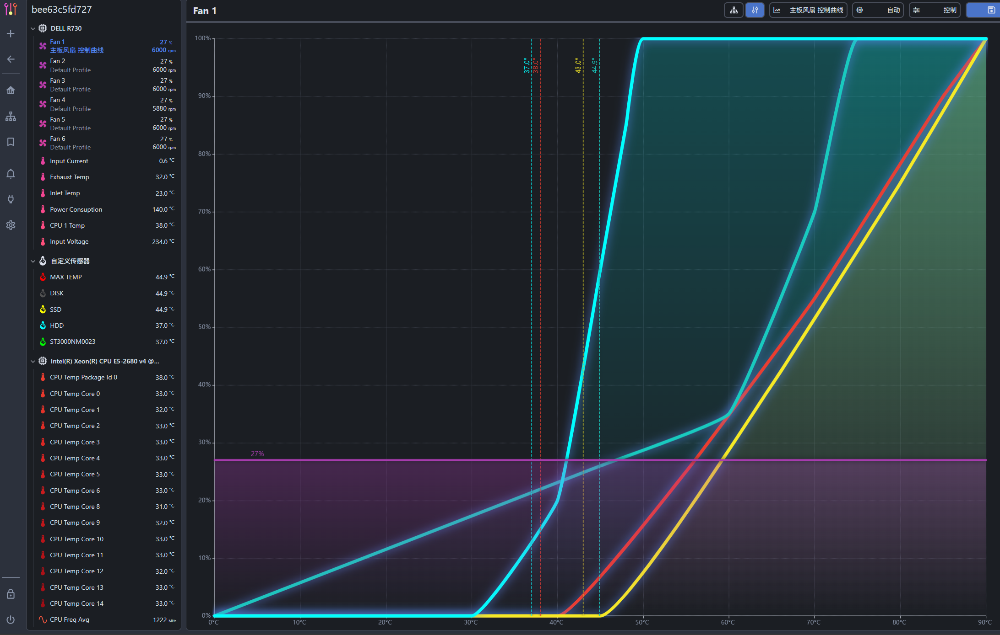

# coolercontrol-custom-device-ipmitool

Integral coolercontrol with custom-device plugin, ipmitool package and rate limiter for monitoring server and fans control via ipmi.

docker --entrypoint /etc/coolercontrol/custom-entrypoint.sh -v <this folder>:/etc/coolercontrol

